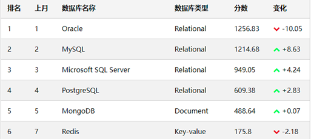
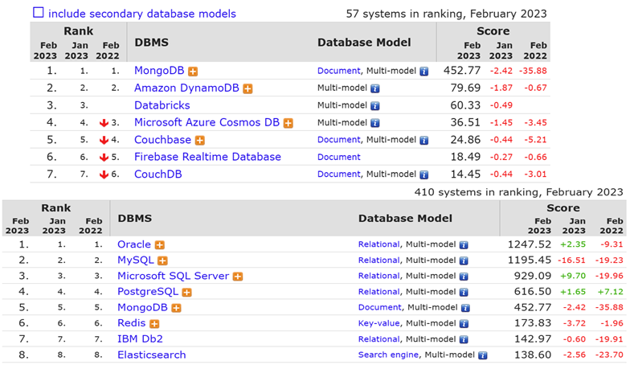
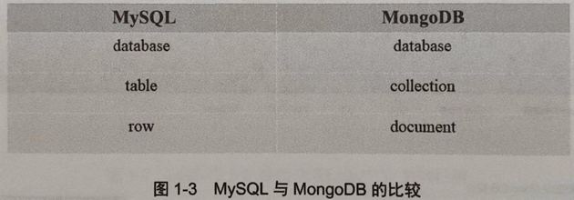
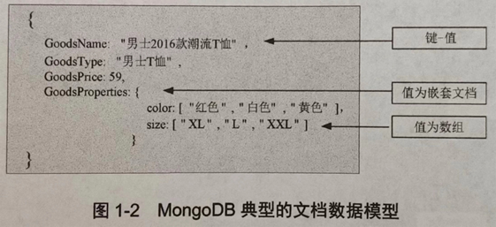
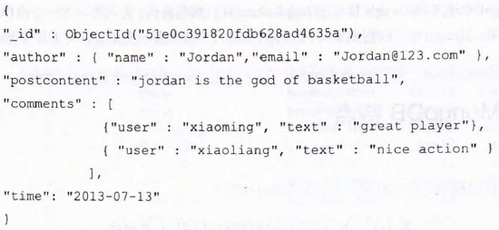

---
# 1.1MongoDB的发展与现状
date:2019-05-05
type:book
---

MongoDB是一个可扩展、开源、表结构自由，用C++语言编写的**面向文档**的分布式文件存储的数据库，旨在为 WEB 应用提供可扩展的高性能数据存储解决方案。

MongoDB 是一个介于关系数据库和非关系数据库之间的产品，是非关系数据库当中功能最丰富，最像关系数据库的。

数据库引擎综合排行榜：第5名数据来源：https://db-engines.com/en/ranking

文档数据库排名第一：https://db-engines.com/en/ranking/document+store

综合排行榜：第5名，数据来源：https://db-engines.com/en/ranking

上述网站可查询最新数据

**MongoDB能支撑大数据系统**

- 实时的可操作的大数据存储系统
- 离线大数据分析系统

**MongoDB天生为云计算而生**

- 可扩展架构，可以启用分片和水平扩展，提供云存储所需的技术；
- 自动管理被称为“副本集”的冗余服务器；

MongoDB为多家领先的云计算供应商，如阿里巴巴，腾讯，360，百度

关系数据库中最基本的单元是行，MongoDB中最基本的存储单元是document，如：

用JSON格式类似的键值对来存储，值的类型有字符串、数字、日期等，也称BSON对象；

MongoDB与关系数据库的重大区别是：可扩展的表结构，即collection中的document所拥有的字段是可以变化的

